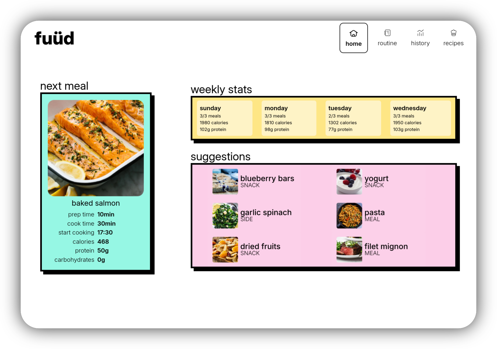

This is a web application front-end for users to manage their diet. Access the published version [here](https://mangiola.github.io/).

This project was written with the [SvelteKit](https://svelte.dev/) Javascript framework. As this is just the front-end, all data (recipes, user stats, etc.) are hardcoded mockups.

## Installing and Running

1. Install Node.js (`sudo apt install npm` for Debian-based Linux)
2. Run `npm i` in the root directory
3. Run `npm run dev` to start a development server
4. To export the final project as static HTML and JS: `npm run build`

## Project Structure

- **/src** - Main project code
    - **/src/lib** - Components and utility files used on different pages
    - **/src/routes** - The actual web pages
- **/static** - Images and assets
- **jsconfig.json, svelte.config.js, vite.config.js** - Generated config files